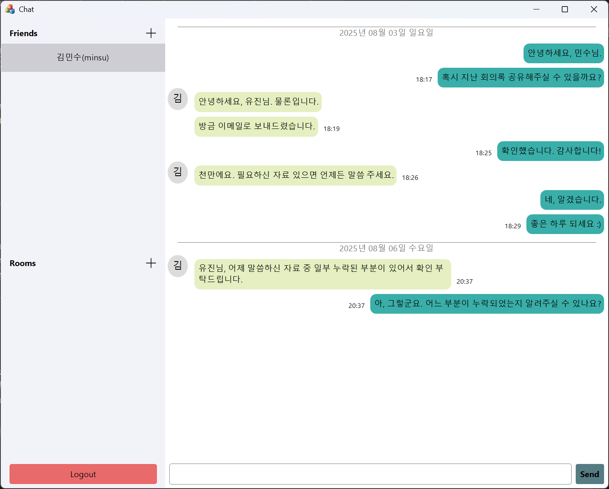
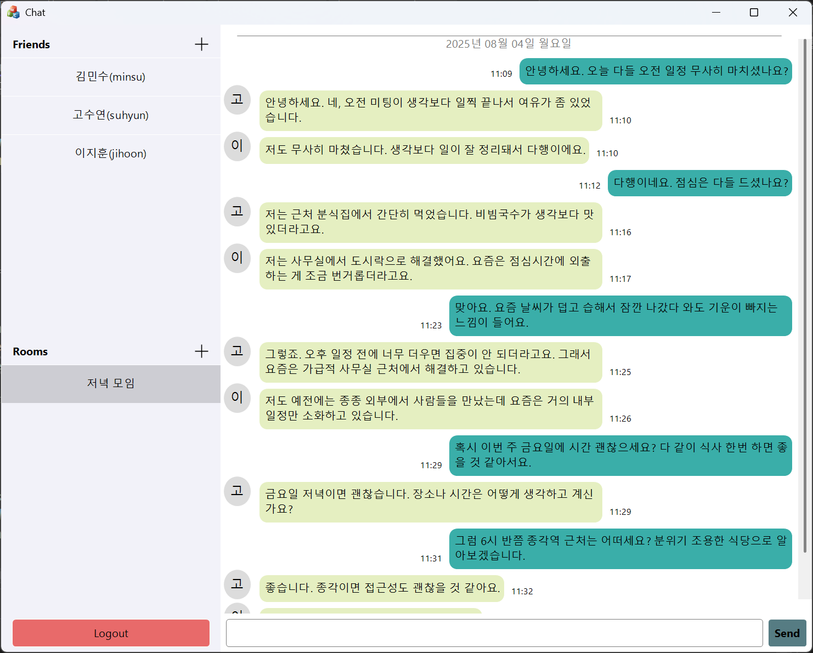

## 📌 Introduction

이 프로젝트는 MFC 기반 Windows 애플리케이션과 C++로 제작된 서버를 이용한 **TCP/IP 기반 채팅 애플리케이션**입니다.  
실시간 통신, DB 연동, 멀티스레딩, 윈도우 메시지 처리, UI 커스터마이징(MFC 기반 커스텀 컨트롤 제작) 등 **Windows 네이티브 프로그래밍 핵심 요소들을 학습하고 구현**한 프로젝트입니다.


## ✨ Functions

### ✅ 사용자 기능
- 회원 가입 / 로그인
- 친구 추가 / 목록 조회
- 1:1 채팅, 그룹 채팅

### 🔧 시스템 기능
- Winsock을 이용한 TCP 통신
- OpenSSL을 이용한 TLS 암호
- 서버-클라이언트 메시지 핸들링
- SQLite 기반 데이터베이스 관리
- PostMessage를 활용한 스레드-UI 간 통신
- 멀티스레드 환경에서의 동기화 처리


## 🖼️ Screenshots

 


## 🛠️ Tools

- **Visual Studio 2022**: 서버/클라이언트(MFC) 개발
- **SQLite3**: 경량형 DB 관리
- **Vcpkg**: 오픈 소스 사용


## 🧠 Skills & Tech Stacks

| 영역 | 기술 |
|------|------|
| Language | C++ |
| Framework | MFC (Microsoft Foundation Class) |
| Network | Winsock (TCP/IP) |
| Database | SQLite3 |
| Thread | std::thread, Windows Message (`PostMessage`) |
| UI | MFC Dialog / Custom Controls |


## 📂 Folder Structure
```
/Client
├── Custom Controls
|     ├── ElementWnd.cpp
|     ├── ItemWnd.cpp
|     ├── EditWnd.cpp
|     ├── ButtonWnd.cpp
|     ├── ContainerWnd.cpp
|     ├── PaneWnd.cpp
|     └── ScrollWnd.cpp
├── View
|     ├── ChatDlg.cpp
|     ├── RoomDlg.cpp
|     └── FriendDlg.cpp
└── Controller
      └── ChatManager.cpp

/Server
├── main.cpp
├── ChatDataManager.cpp
├── ChatServer.cpp
└── ClientSession.cpp
```

## 📝 Instructions
### 🔐 Self-Signed SSL 인증서 생성
다음 명령어로 SSL 인증서를 생성할 수 있습니다:
```bat
openssl genrsa -out server.key 2048
openssl req -new -x509 -key server.key -out server.crt -days 365
```
